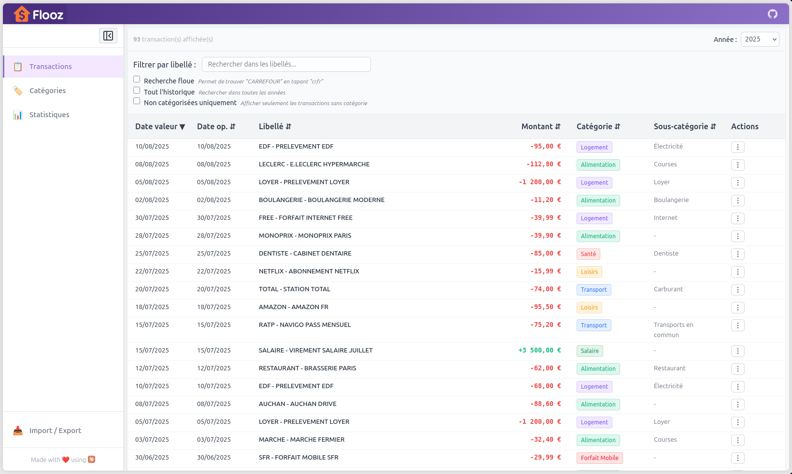
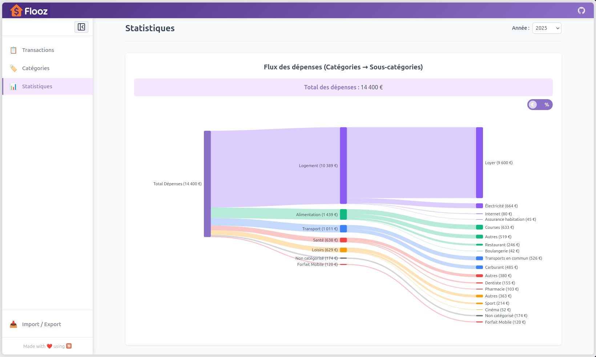
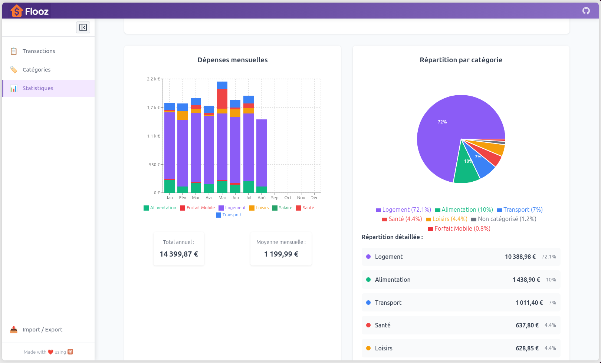
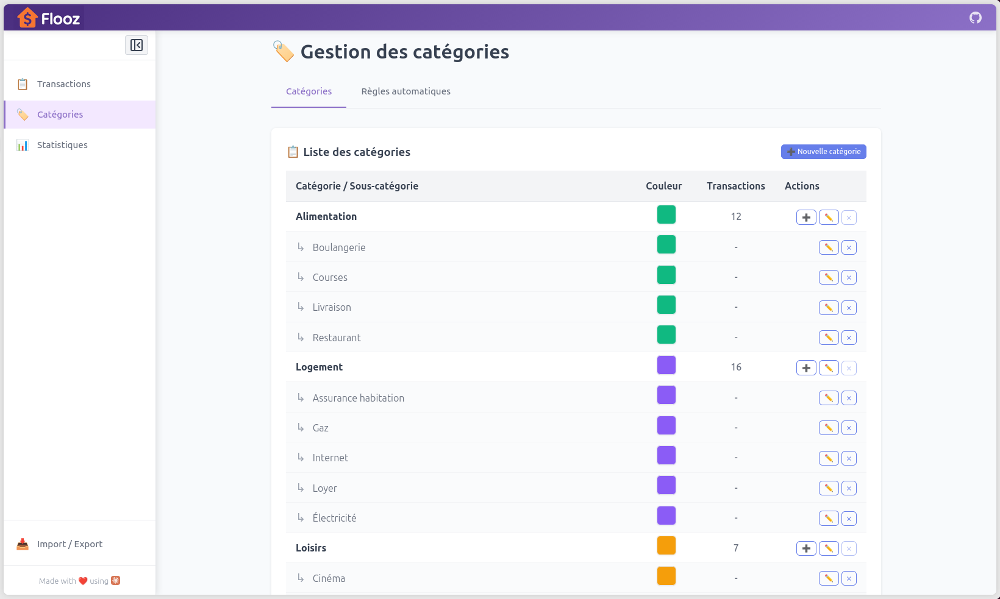

<div align="center">
  
</div>

# Flooz

<div align="right">
  <a href="README.md">🇫🇷 Version française</a>
</div>

Flooz is a simple and fast web application to track your expenses.<br>
Automatic import from your bank statements, smart categorization, and clear visualizations to understand where your money goes.

> **About the name**: *Flooz* come from French slang word *flouze*, which is "money" or "cash". Which itself come from Arabic.

<br>
<div align="center">
  
  
  
  
  <br>
  General look and feel
</div>


## KISS (keep-it-simple-stupid) 🧘
- Installation and usage with a single command
- SQLite database in **a single file** (easy to backup)
- No login or multi-user management
  - Easily shareable on a NAS or small home server
- **Smart import** and automatic categorization
  - Drag-and-drop your CSV or QIF bank files
  - Preview before import with category modification
  - Create categorization rules for future imports
  - Automatic duplicate detection
- **Categorization**
  - Subcategories for more precision
  - Bulk categorization
- **Clear visualizations**
  - Category distribution chart
  - Monthly and category-based graphs
  - Year-over-year comparison with customizable periods
- **Data export**
  - CSV export: all transactions or consolidation by category
  - Complete JSON export with all data
  - SQLite binary export for backup

## DISCLAIMER ⚠️
 Flooz is entirely ***vibe-coded***, and I have no particular expertise in the technologies used...<br>
 No guarantee is provided regarding accuracy or data loss.

## Installation and Startup 🚀

### Prerequisites

- Python 3.8+
- Node.js 18+ and npm
- pip/venv

### Quick Start

```bash
git clone https://github.com/guzu/flooz.git
cd flooz
./install-deps.sh
./start.sh
```

The application will be available at: http://localhost:3000

### Local Network Sharing 🌐

To allow access from other devices on your local network:
```bash
./start.sh --network
```

⚠️ **Note**: Recommended only for a trusted local network.

## Docker Deployment 📦

### Single Container

```bash
# Option 1: Docker Compose (recommended)
docker-compose up -d

# Option 2: Automatic script
./docker-start.sh
```

**Application available at**: http://localhost

See [DOCKER.md](DOCKER.md) for more details.

## Database Management

The database is **automatically created on first startup**.

### Reset

```bash
cd backend
source venv/bin/activate
python init_db.py --reset
```

The SQLite database is stored in `data/flooz-budget.db`.

### Automatic Backups 💾

#### Binary backup (SQLite) - local

```bash
cp data/flooz-budget.db /somewhere/flooz-budget-$(date '+%F-%T').db
```

#### Binary backup (SQLite) - remote

```bash
curl -o ~/backups/flooz-$(date '+%F-%T').db http://localhost:5000/api/export/database
```

#### Complete JSON export - remote
```bash
curl -o flooz-export-$(date '+%F-%T').json http://localhost:5000/api/export/json
```

# Documentation 📒

- **[docs/API.md](docs/API.md)** - Complete REST API documentation
- **[docs/CONTRIBUTING.md](docs/CONTRIBUTING.md)** - Developer guide and architecture
- **[docs/TESTING.md](docs/TESTING.md)** - Testing guide
- **[DOCKER.md](DOCKER.md)** - Detailed Docker deployment
- **[CLAUDE.md](CLAUDE.md)** - Guide for Claude Code (AI)

## Technologies

- **Backend**: Python, Flask, SQLite
- **Frontend**: React, Vite, Recharts, D3-Sankey
- **Deployment**: Docker, Nginx

# License 🫶

**CC BY-NC-SA 4.0** - Non-Commercial ShareAlike

### Additional conditions for public hosting

If you offer Flooz hosting (public or shared instance):
- **Name preservation**: The application MUST keep the name "Flooz"
- **Source indication**: You MUST keep the link or mention of the original repository

[Full license text](https://creativecommons.org/licenses/by-nc-sa/4.0/)
